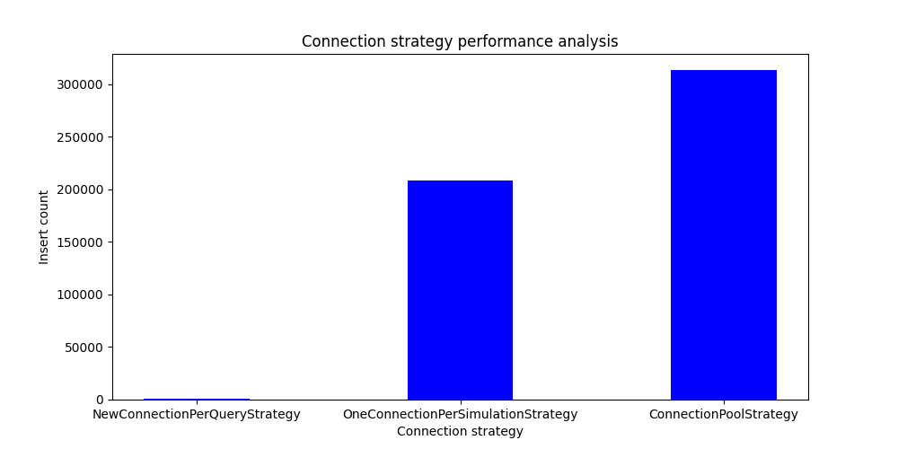
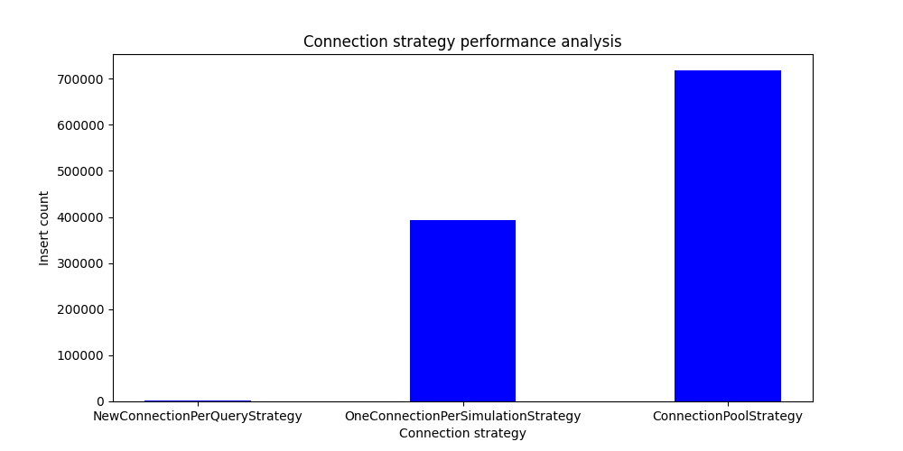

# Description

This project is meant to analyze the performance of database queries using different connection strategies
The script will run an insert sql query for a specified time with the following connection strategies:

1. A new connection will be created for each query
2. The same connection will be used for the entire duration of the test
3. A connection pool will be used, the queries will be run using a TH number of threads

# Installation

* Install python >= 3.11.*
* Install postgresql server >= 15
* Clone or download the repository
* Create a test database:

        set PGPASSWORD=<your_password>
        psql -U <your_username> -c "create database <choose_database_name>"

* cd into the project root directory:
  * Create a virtual environment:
        
        python -m venv .venv

  * Activate the virtual environment:
      
        .venv\Scripts\activate
  
  * Install the required packages:
  
        pip install -r requirements.txt

  * Create a .env file, and replace with your values. The script assumes the postgres server is on localhost and port 5432:
  
        DB_NAME=<name_of_the_database_you_created>
        DB_USER=<postgres_username>
        DB_PASSWORD=<postgres_password> 

# Usage

* To setup the test table run:

        python main.py setup

* All simulations will start by running:

        python main.py start --time <time_of_the_simulation_in_minutes> --threads <integer_number_of_threads> 

# Expectations

* The first strategy will have the lowest number of total inserts due to the overhead from creating a new connection each time
* A single connection will have a significant larger number of total inserts compared to the first strategy
* The number of inserts / thread will be a bit lower than the above strategy due to synchronization, but overall a larger number
  of inserts due to an increased number of threads

# Results

| One Minute with two theads 	| Two minutes with four threads 	                                            |
|---	|----------------------------------------------------------------------------|
|  	|  	 |