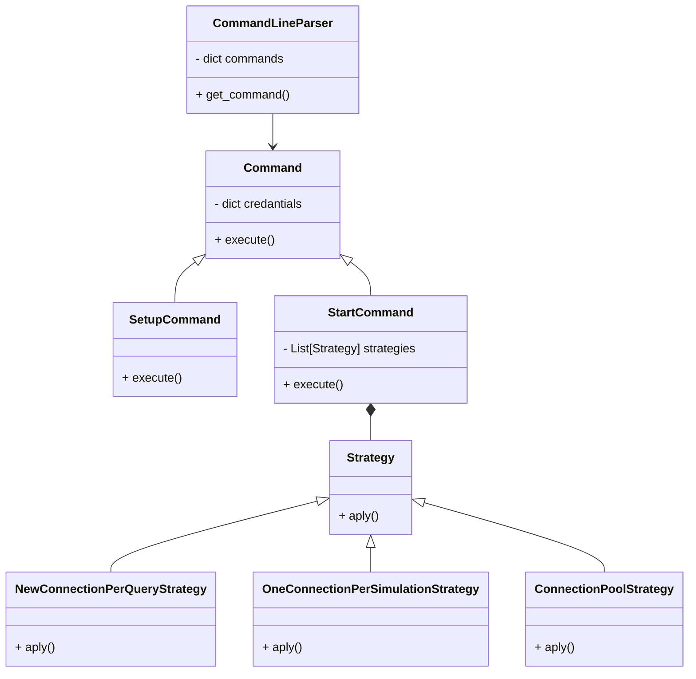

```mermaid
classDiagram
    class CommandLineParser {
        - dict commands
        + get_command()
    }
    
    class Command {
        - dict credantials
        + execute()
    }
    
    class SetupCommand {
        + execute()
    }
    
    class StartCommand {
        - List[Strategy] strategies
        + execute()
    }
    
    class Strategy {
        + aply()
    }
    
    class NewConnectionPerQueryStrategy {
        + aply()
    }
    
    class OneConnectionPerSimulationStrategy {
        + aply()
    }
    
    class ConnectionPoolStrategy {
        + aply()
    }
    
    Strategy <|-- NewConnectionPerQueryStrategy
    Strategy <|-- OneConnectionPerSimulationStrategy
    Strategy <|-- ConnectionPoolStrategy
    
    Command <|-- SetupCommand
    Command <|-- StartCommand
    StartCommand *-- Strategy
    CommandLineParser --> Command
```